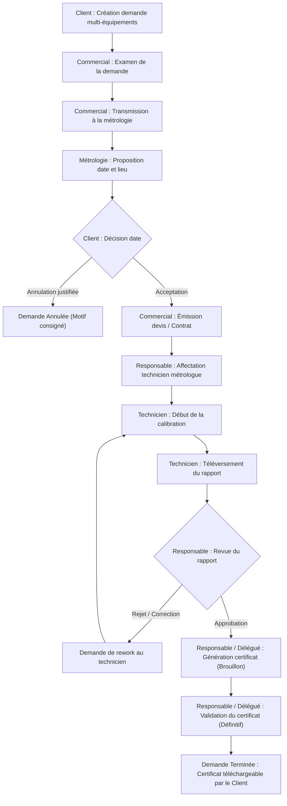

# Application Web de Gestion de la Calibration des Équipements
*(Calibration Equipment Management Web Application)*

Plateforme SaaS d'entreprise de gestion complète du cycle de vie de la calibration d'équipements de mesure et de métrologie industrielle, développée avec **Laravel 12/13**, **Inertia.js**, **React 19**, **TypeScript** et **Tailwind CSS v4**.

L'application respecte à la lettre l'ensemble des 56 sections du cahier des charges fonctionnel et technique (`Application Specification — Calibration Equipment Management Web Application.md`), avec une interface 100% en langue française.

---

## Sommaire

1. [Fonctionnalités Principales](#-fonctionnalités-principales)
2. [Cycle de Vie du Processus Métrologique](#-cycle-de-vie-du-processus-métrologique)
3. [Matrice des Rôles & Habilitations](#-matrice-des-rôles--habilitations)
4. [Comptes de Démonstration Préconfigurés](#-comptes-de-démonstration-préconfigurés)
5. [Installation & Démarrage](#-installation--démarrage)
6. [Suite de Tests Automatisés](#-suite-de-tests-automatisés)
7. [Architecture Technique & Sécurité](#-architecture-technique--sécurité)

---

## 🌟 Fonctionnalités Principales

- **Portail Public & Catalogue Métrologique (Sections 38, 48)** : Présentation des domaines de calibration (Pression, Température, Électrique, Dimensionnel, Pesage, Couple), recherche des prestations, accès rapide à la connexion.
- **Gestion Multi-Équipements par Demande (Sections 12, 13, 20)** : Le client soumet en une seule demande plusieurs instruments de mesure avec spécifications (numéro de série, marque, modèle, plage, tolérance, quantité, notes).
- **Routage & Traitement Commercial (Sections 14, 15, 23)** : Réception par le service commercial, transmission qualifiée à la métrologie, émission de devis et association contractuelle.
- **Planification & Négociation de Date (Sections 15, 21)** : Proposition d'une date d'intervention et du lieu (laboratoire ou sur site client) par la métrologie, acceptation ou annulation motivée par le client.
- **Affectation & Pilotage Métrologique (Sections 16, 24)** : Tableau de bord du Responsable avec supervision de la charge des techniciens, affectation d'un métrologue qualifié par opération.
- **Exécution & Téléversement des Rapports (Sections 17, 25)** : Prise en charge par le technicien, exécution selon modes opératoires, téléversement sécurisé du rapport de calibration (PDF, DOC, DOCX).
- **Revue Qualité & Rejet avec Rework (Sections 18, 26)** : Contrôle par le Responsable Métrologie (Approbation pour certificat ou Demande de correction avec motif obligatoire et réaffectation au technicien).
- **Génération & Validation de Certificats (Sections 19, 27)** : Certificat initialisé en brouillon, puis validé officiellement. Dès validation, le certificat devient définitif, horodaté et téléchargeable par le client.
- **Immutabilité des Certificats (Section 47)** : Protection stricte contre toute modification ou ré-approbation dès lors qu'un certificat est rendu définitif (`is_final = true`).
- **Délégation & Continuité de Service (Section 28)** : En cas d'absence du responsable de laboratoire, un technicien métrologue adjoint habilité (`is_delegated_manager = true`) dispose des droits de validation avec traçabilité intégrale de l'identité du signataire.
- **Isolation Multi-Tenants des Clients (Sections 12, 46)** : Cloisonnement strict des données — chaque client ne peut consulter ou télécharger que ses propres demandes, contrats et certificats.
- **Gestion des Étalons & Matériels de Référence (Section 34)** : Répertoire des étalons du laboratoire avec numéros de série, classes de précision, dates de calibration et alertes automatiques sur étalons périmés.
- **Traçabilité & Piste d'Audit Complète (Sections 31, 32)** : Enregistrement de chaque changement de statut avec auteur et date, journalisation d'audit des actions critiques (adresses IP, anciennes/nouvelles valeurs).
- **Centre de Notifications en Temps Réel (Section 30)** : Notifications contextuelles par rôle et par utilisateur lors de chaque franchissement d'étape.

---

## 🔄 Cycle de Vie du Processus Métrologique



---

## 🛡 Matrice des Rôles & Habilitations

| Rôle | Périmètre & Responsabilités | Tableau de bord dédié |
| :--- | :--- | :--- |
| **Client** | Demandes de calibration, suivi du cycle, acceptation de date, annulation pré-intervention, téléchargement des certificats validés et contrats. | `/client/dashboard` |
| **Commercial** | Réception des demandes, transmission à la métrologie, création des devis & contrats, gestion des fiches clients. | `/commercial/dashboard` |
| **Métrologie (Technicien)** | Consultation des calibrations assignées, proposition de calendrier, réalisation des calibrations, téléversement des rapports. | `/metrology/dashboard` |
| **Responsable Métrologie** | Supervision globale, affectation des techniciens, revue et approbation des rapports, génération et validation finale des certificats. | `/manager/dashboard` |
| **Métrologue Délégué (Section 28)** | Technicien métrologue disposant du flag d'intérim / délégation pour valider les certificats lors d'absences du responsable. | `/manager/dashboard` |
| **Administrateur** | Gestion des utilisateurs et rôles, catalogue de calibration, archives documentaires, journaux d'audit de sécurité. | `/admin/dashboard` |

---

## 👥 Comptes de Démonstration Préconfigurés

Tous les comptes ci-dessous sont injectés par les seeders (`php artisan db:seed` ou `migrate:fresh --seed`). Le mot de passe par défaut pour tous les comptes est : `password`.

| Email | Mot de passe | Rôle | Description / Profil |
| :--- | :--- | :--- | :--- |
| `admin@metrolab.fr` | `password` | **Administrateur** | Accès technique global, gestion utilisateurs, catalogue et audit |
| `responsable@metrolab.fr` | `password` | **Responsable Métrologie** | Responsable du laboratoire métrologique |
| `metrologie.adjoint@metrolab.fr` | `password` | **Métrologie (Délégué)** | Technicien adjoint habilité à la validation des certificats (Section 28) |
| `metrologie@metrolab.fr` | `password` | **Métrologie** | Technicienne métrologue de référence |
| `commercial@metrolab.fr` | `password` | **Commercial** | Chargé des devis, contrats et clients |
| `client@acme.fr` | `password` | **Client** | Société Acme Industries SAS (demandes en cours & certificats) |
| `client@autrecorp.fr` | `password` | **Client** | Société Autre Corporation SARL (isolation multi-tenant) |

---

## 🚀 Installation & Démarrage

### Prérequis
- **PHP** : >= 8.2 (avec extensions pdo, pdo_sqlite ou pdo_mysql, mbstring, curl)
- **Composer** : >= 2.x
- **Node.js** : >= 18.x & **npm**

### Étapes d'installation

1. **Cloner le dépôt et accéder au dossier** :
   ```bash
   git clone <repo-url>
   cd bassem
   ```

2. **Installer les dépendances PHP et JavaScript** :
   ```bash
   composer install
   npm install
   ```

3. **Configurer l'environnement** :
   ```bash
   cp .env.example .env
   php artisan key:generate
   ```
   *L'environnement est préconfiguré pour utiliser la base SQLite locale (`database/database.sqlite`) et la langue française (`APP_LOCALE=fr`).*

4. **Initialiser la base de données et les données de démonstration** :
   ```bash
   touch database/database.sqlite
   php artisan migrate:fresh --seed
   ```
   *Cette commande crée toutes les tables, configure les rôles/permissions, crée le catalogue de calibration, les étalons de référence, les comptes de démonstration ainsi que des cas d'usage complets avec fichiers PDF réels.*

5. **Compiler les ressources frontend** :
   ```bash
   npm run build
   ```
   *Ou en mode développement avec rafraîchissement à chaud :*
   ```bash
   npm run dev
   ```

6. **Démarrer le serveur applicatif** :
   ```bash
   php artisan serve
   ```
   L'application est accessible à l'adresse : [http://localhost:8000](http://localhost:8000).

---

## 🧪 Suite de Tests Automatisés

Une suite complète de 56 tests automatisés (Pest PHP / PHPUnit) vérifie de bout en bout la conformité aux exigences fonctionnelles et de sécurité (Section 52) :

```bash
php artisan test
```

### Couverture des tests (`tests/Feature/CalibrationWorkflowTest.php`) :
- Création de demande multi-équipements avec validation stricte
- Transmission commerciale à la métrologie et contrôle d'accès
- Proposition de date et de lieu d'intervention par la métrologie
- Acceptation de la date par le client
- Annulation par le client dans les statuts annulables et blocage dans les statuts non annulables
- Création de contrat commercial et association à la demande
- Affectation d'un technicien métrologue par le responsable
- Démarrage de la calibration et téléversement du rapport avec validation de format
- Cycle de revue par le responsable : rejet avec notes obligatoires puis approbation
- Génération du certificat en mode brouillon et validation finale
- Respect strict de l'immutabilité des certificats validés
- Validation de certificat par un métrologue adjoint/délégué (Section 28)
- Ségrégation multi-tenant : impossibilité pour un client A d'accéder aux certificats ou contrats d'un client B
- Blocage du téléchargement des certificats brouillons non encore validés
- Gestion et filtrage des étalons de métrologie expirés

---

## 🏗 Architecture Technique & Sécurité

- **Backend** : Laravel 12/13, Architecture orientée services (`WorkflowService`, `NotificationService`).
- **Frontend** : Inertia.js 2 avec React 19, TypeScript, composants UI responsives Tailwind CSS v4, icônes Lucide.
- **Navigation adaptative** : Sidebar dynamique s'ajustant automatiquement selon le rôle actif de l'utilisateur (Section 56).
- **Stockage Sécurisé** : Stockage privé des documents (`storage/app/private/reports`, `storage/app/private/certificates`) avec téléchargement contrôlé par Policies d'autorisation (`DocumentPolicy`, `CalibrationCertificatePolicy`).
- **Authentification & Habilitations** : Authentification Laravel Fortify / Breeze avec support Passkeys et Double Facteur (2FA), Middleware `EnsureUserHasRole` (`role:client`, `role:commercial`, etc.), Policies granulaires par entité.
- **Localisation** : 100% Français dans l'ensemble des écrans, formulaires, messages de validation (`lang/fr/validation.php`), notifications et libellés d'état.
